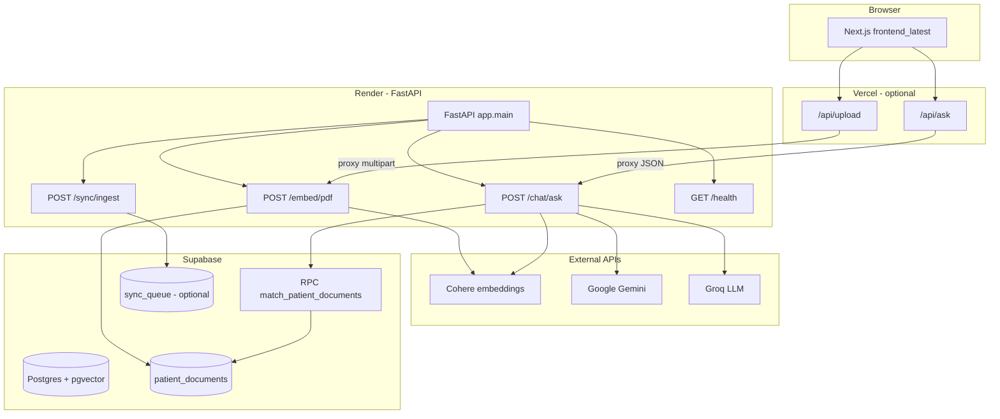

# SIH 2025 — ArogyaLink Medical RAG Chatbot

Patient-scoped **retrieval-augmented generation (RAG)** chatbot for health-related documents. Users upload PDFs (per patient ID), text is chunked and embedded into **Supabase** (`pgvector`), and questions are answered using **Gemini** and **Groq** with context from the patient’s own chunks.

The repository is organized around:

- **`chatbot_module_online/`** — main application (FastAPI backend + Next.js UI used for production-style deployment).
- **Production-style hosting** — UI on **Vercel**, API on **Render**, vectors and metadata in **Supabase**.

---

## Architecture



**Request flow (chat):**

1. Browser calls Next.js **`POST /api/ask`** with `message`, `patientId`, `topK`.
2. Route handler forwards to **`POST {BACKEND}/chat/ask`** on the FastAPI server (local or Render).
3. Backend embeds the question with **Cohere** (`search_query`), runs **`match_patient_documents`** in Supabase, builds a prompt from retrieved chunks, then calls **Gemini** first and **Groq** on failure.

**Request flow (upload):**

1. Browser sends **`POST /api/upload`** with `patientId` and PDF.
2. Next.js builds `multipart/form-data` and proxies to **`POST {BACKEND}/embed/pdf`**.
3. Backend extracts text (PDF/DOCX), chunks, embeds with Cohere (`search_document`), inserts rows into **`patient_documents`**.

---

## Repository layout

| Path | Role |
|------|------|
| `chatbot_module_online/chatbot-backend/` | **FastAPI** service: embed, chat, sync, health. |
| `chatbot_module_online/frontend_latest/` | **Primary Next.js 14** app (ArogyaLink UI, `/api/ask`, `/api/upload`). Intended for **Vercel**. |
| `chatbot_module_online/chatbot-frontend/` | Older Next.js variant (alternate UI). |
| `chatbot_module_online/chatbot-frontend-new/` | **Vite + React** UI (design system / alternate client). |
| `chatbot_module_online/requirements.txt` | Python dependencies for the backend (used by Docker and `pip install -r`). |
| `chatbot_module_online/Dockerfile` | Builds the API image (Python 3.11, uvicorn on port 8000). |
| `chatbot_module_online/docker-compose.yml` | Runs the backend container with `.env`. |
| `chatbot_module_online/*.md` | Extra ops notes (`QUICK_START.md`, `START_SERVICES.md`, etc.). |

Backend source highlights:

- `app/main.py` — FastAPI app, CORS, router registration, `/health`.
- `app/config.py` — Environment-driven settings (`COHERE_API_KEY`, `SUPABASE_*`, `GEMINI_API_KEY`, `GROQ_API_KEY`, `VECTOR_DIM`, `HOST`, `PORT`).
- `app/routers/embed_router.py` — `POST /embed/pdf` (PDF/DOCX upload per `patient_id`).
- `app/routers/chat_router.py` — `POST /chat/ask` (RAG + LLM).
- `app/routers/sync_router.py` — `POST /sync/ingest` (writes to `sync_queue`; table must exist in Supabase).
- `app/services/embeddings.py` — Cohere `embed-english-v3.0` (default 1024-dim).
- `app/services/embeddings_and_store.py` — Extract → chunk → embed → batch insert into `patient_documents`.
- `app/services/llm_providers.py` — Async **Gemini** + **Groq** with fallback order.
- `app/db/supabase_client.py` — Supabase client (requires `SUPABASE_URL` and `SUPABASE_KEY`).
- `app/models/sql/patient_documents.sql` — **`pgvector` table + `match_patient_documents` RPC** (run in Supabase SQL editor).
- `app/utils/text_splitter.py` — Fixed-size chunks with overlap (default 1000 / 150).
- `app/utils/security.py` — Optional Fernet helpers (`FERNET_KEY`); not wired into main chat path by default.

---

## Supabase (vector store)

1. In the Supabase project, enable the **`vector`** extension and run the SQL in:

   `chatbot_module_online/chatbot-backend/app/models/sql/patient_documents.sql`

   This creates:

   - Table **`patient_documents`** with column **`embedding vector(1024)`** (aligned with Cohere `embed-english-v3.0`).
   - Function **`match_patient_documents(query_embedding, match_count, patientid)`** for cosine-style distance (`<=>`) scoped by **`patient_id`**.

2. For **`POST /sync/ingest`**, add a **`sync_queue`** table matching the insert in `sync_router.py` (`patient_id`, `item_type`, `payload`), or leave that endpoint unused.

3. Use the Supabase **service role** or a key with rights to insert/select and execute the RPC, depending on your security model. Never commit real keys to git (`.env` is gitignored).

---

## Environment variables

### Backend (`chatbot_module_online/chatbot-backend/.env` or Docker `env_file`)

| Variable | Required | Purpose |
|----------|----------|---------|
| `COHERE_API_KEY` | Yes | Document and query embeddings. |
| `SUPABASE_URL` | Yes | Supabase project URL. |
| `SUPABASE_KEY` | Yes | Supabase API key (service role or appropriate secret). |
| `GEMINI_API_KEY` | Yes* | Primary LLM (*needed unless you only use Groq via `provider_order`). |
| `GROQ_API_KEY` | Yes* | Fallback LLM. |
| `VECTOR_DIM` | No | Default `1024` (must match DB vector dimension). |
| `HOST` / `PORT` | No | Defaults `0.0.0.0` / `8000`. |
| `APP_DEBUG` | No | Logging verbosity flag in config. |
| `FERNET_KEY` | No | Used by `app/utils/security.py` if you integrate encryption. |
| `OPENAI_API_KEY` | No | Present in config; not required by current routers. |

### Frontend (`chatbot_module_online/frontend_latest/.env.local` for local dev)

| Variable | Purpose |
|----------|---------|
| `NEXT_PUBLIC_API_URL` or `API_URL` | Base URL of the FastAPI backend (no trailing slash), e.g. `http://localhost:8000` or your **Render** URL. |

If unset, the API routes use a hardcoded Render URL in `chatbot_module_online/frontend_latest/app/api/ask/route.ts` and `app/api/upload/route.ts` (`https://sih2025-chatbot-working.onrender.com`). Set `NEXT_PUBLIC_API_URL` or `API_URL` for your own backend.

---

## Run locally

### Prerequisites

- **Python 3.11+** (3.11 matches Docker).
- **Node.js 18+** (for Next.js 14).
- Supabase project with SQL applied; **Cohere**, **Gemini**, and **Groq** API keys.

### 1. Backend (FastAPI)

```powershell
cd chatbot_module_online
pip install -r requirements.txt
cd chatbot-backend
# Create .env with the variables above (see chatbot_module_online/README.md)
uvicorn app.main:app --host 0.0.0.0 --port 8000 --reload
```

Or from `chatbot-backend` on Windows:

```powershell
.\start-server.bat
```

Verify: [http://localhost:8000/health](http://localhost:8000/health) → `{"status":"ok"}`. Interactive docs: [http://localhost:8000/docs](http://localhost:8000/docs).

### 2. Frontend (recommended: `frontend_latest`)

```powershell
cd chatbot_module_online\frontend_latest
npm install
```

Create `.env.local`:

```env
NEXT_PUBLIC_API_URL=http://localhost:8000
```

```powershell
npm run dev
```

Open [http://localhost:3000](http://localhost:3000): set **Patient ID**, upload **PDFs** via the upload tab, then ask questions in the chat tab.

### 3. One-command helpers (Windows PowerShell)

From `chatbot_module_online/`:

- `.\start-backend.ps1` — uvicorn on port 8000 (frees port 8000 if in use).
- `.\start-frontend.ps1` — `npm run dev` in `frontend_latest`.
- `.\start-all.ps1` — opens two windows for backend and frontend.

### 4. Docker (backend only)

From `chatbot_module_online/` (ensure `.env` exists next to `docker-compose.yml`):

```powershell
docker compose up --build
```

Backend listens on **8000**. Run the Next.js app separately if you need the full UI.

---

## Deployment (Vercel + Render + Supabase)

| Layer | Platform | Notes |
|-------|----------|--------|
| **Database & vectors** | **Supabase** | Run `patient_documents.sql`; store secrets in Supabase dashboard. |
| **API** | **Render** (or any container host) | Build from `Dockerfile` with root context `chatbot_module_online`, or run `uvicorn` with `requirements.txt`. Set all backend env vars in the Render dashboard. Health check: `GET /health`. |
| **Web UI** | **Vercel** | Set project root to `chatbot_module_online/frontend_latest` (or monorepo subfolder). Set `NEXT_PUBLIC_API_URL` to your **Render** HTTPS URL. |

**CORS:** Backend currently allows `allow_origins=["*"]`. For production, restrict to your Vercel domain.

**Timeouts:** `frontend_latest` API routes use `maxDuration` (e.g. 60s ask, 120s upload) for serverless limits; large PDFs may need smaller files or a longer-running backend path.

---

## API reference (FastAPI)

| Method | Path | Description |
|--------|------|-------------|
| `GET` | `/health` | Liveness check. |
| `POST` | `/embed/pdf` | Form: `patient_id`, `file` (PDF or DOCX). Returns `chunks_inserted`. |
| `POST` | `/chat/ask` | JSON: `patient_id`, `question`, optional `top_k`, `provider_order`. Returns `answer` and `sources`. |
| `POST` | `/sync/ingest` | JSON: `patient_id`, `item_type`, `payload`. Requires `sync_queue` table. |

Next.js proxies (same host as UI):

- `POST /api/ask` → backend `/chat/ask`
- `POST /api/upload` → backend `/embed/pdf` (PDF only in the Next route validation; backend also accepts DOCX direct)

---

## Other frontends

- **`chatbot-frontend/`** — Next.js app with similar stack; not the default in `start-frontend.ps1`.
- **`chatbot-frontend-new/`** — Vite/React; run with `npm install` and `npm run dev` after configuring API base URL in that app’s code or env (if wired).

---

## License

See `LICENSE` in the repository root.

---

## Further reading

- `chatbot_module_online/QUICK_START.md` — Short verification checklist.
- `chatbot_module_online/README.md` — Original backend-focused overview.
- `chatbot_module_online/START_SERVICES.md`, `DEBUGGING_BACKEND_CONNECTION.md` — Operational troubleshooting.
