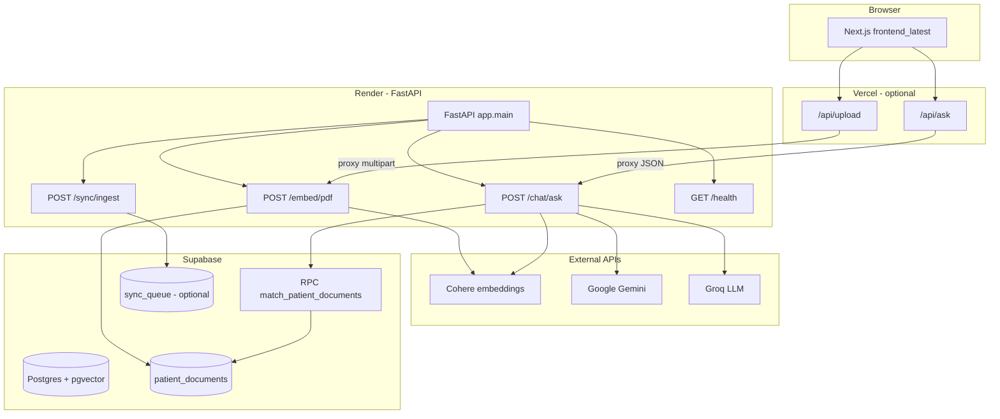

# SIH 2025 — ArogyaLink Medical RAG Chatbot

---
### What is this?

**ArogyaLink** is a smart assistant that answers questions **based on medical documents you (or your team) upload**—for example lab reports, discharge summaries, or notes saved as PDF files. It is **not** a replacement for a doctor or a diagnosis; it helps people **find and understand information that is already in those files**.

In technical terms, it is a **patient-scoped** system: each **Patient ID** acts like a separate folder. Documents uploaded under one ID are only used when someone asks questions for **that same ID**. That way, one person’s papers are not mixed with another’s.

### How does it work, step by step?

1. **You open the website** (the part you see in the browser—colors, buttons, chat box).
2. **You enter a Patient ID** so the system knows which “folder” of documents to use.
3. **You upload PDFs** (reports, etc.). The system reads the text, splits it into small pieces, and **remembers** them in a secure database (**Supabase**), in a form that allows **semantic search** (finding passages that *mean* something similar to your question, not only exact words).
4. **You type a question** in chat. The system finds the most relevant pieces from *that patient’s* uploads, then uses **AI models** (Google **Gemini** first, with **Groq** as a backup) to write an answer **grounded in those passages**, with references where possible.

So: **your files → stored and indexed per patient → questions pull from those files → the AI explains in natural language.**

### Where does it run when it is “on the internet”?

Think of three cooperating pieces:

| In simple terms | What it is | Typical hosting |
|-----------------|------------|-----------------|
| **The screen you click** | The website / chat and upload pages | **Vercel** (hosts the user-facing app) |
| **The engine in the middle** | The service that reads PDFs, talks to the database, and calls the AI | **Render** (hosts the backend API) |
| **The filing cabinet** | Database that stores text chunks and “meaning” vectors for search | **Supabase** |

You still need **API keys** (passwords for external AI and embedding services) set up by whoever deploys the project—those are not visible to end users.

### Who should read which part of this document?

- **If you are not technical:** read **this plain-English section** and the short **“Running it on your computer (simple checklist)”** below. For anything that mentions commands, Python, or environment variables, you can share this README with a developer or IT person.
- **If you are building or hosting the app:** continue from **Technical documentation** onward for architecture, file layout, environment variables, and API details.

### Quick glossary (words you will see later)

| Term | Simple meaning |
|------|----------------|
| **RAG** | The system **retrieves** relevant lines from your uploaded files, then **generates** an answer based on them (not only from generic internet knowledge). |
| **Backend / API** | The “behind the scenes” service the website calls to upload files, search the database, and talk to AI. |
| **Frontend** | What you see in the browser: pages, chat, upload buttons. |
| **Supabase** | Cloud database used here to store text chunks and searchable “meaning” data (**vectors**). |
| **Embedding / vector** | A mathematical fingerprint of text so the system can find passages **similar in meaning** to a question. |
| **Patient ID** | A text label that **groups** one person’s documents; searches use only that group’s data. |
| **Vercel / Render** | Hosting companies: Vercel for the **site**, Render for the **backend** in the usual setup described here. |

---

## Demo Patient ID

For demos, documentation screenshots, and end-to-end testing, use this sample identifier:

| Field | Value |
|--------|--------|
| **Patient ID** | `patient0021` |

**How to use it:** enter **`patient0021`** in the **Patient ID** field on both the **Upload** and **Chat** tabs. Documents indexed under that ID are the only ones used when you ask questions with the same ID—nothing is hardcoded in the backend; this is simply a **documented demo string** you can rely on in tutorials. In production, use your own patient or case identifiers; they are stored in Supabase as plain `patient_id` values on `patient_documents` rows.

---

## Running it on your computer (simple checklist)

You need a **developer setup** (this is not a single “Install” button like a phone app). At a high level:

1. **Install tools** on the computer: **Python** (for the engine), **Node.js** (for the website), and optionally **Docker** if you run the engine in a container.
2. **Create accounts and keys** (a technical person usually does this): Supabase project, and API access for the AI/embedding providers listed in the technical section.
3. **Start the engine** (backend) so it listens on a port (e.g. `8000`).
4. **Start the website** (frontend) so it opens in the browser (e.g. `3000`), and point it at that engine using a small config file (`.env.local`).
5. Open the local address in the browser, enter a Patient ID (try the demo ID **`patient0021`**), upload PDFs, then chat.

Exact copy-paste commands for Windows and folder names are in **Run locally** under [Technical documentation](#technical-documentation) below.

---

## Technical documentation

Patient-scoped **retrieval-augmented generation (RAG)** chatbot for health-related documents. Users upload PDFs (per patient ID), text is chunked and embedded into **Supabase** (`pgvector`), and questions are answered using **Google Gemini** first, with **Groq** as a **mandatory fallback** when Gemini fails or returns unusable output—see [LLM orchestration](#llm-orchestration-gemini--groq) below.

The repository is organized around:

- **`chatbot_module_online/`** — main application (FastAPI backend + Next.js UI used for production-style deployment).
- **Production-style hosting** — UI on **Vercel**, API on **Render**, vectors and metadata in **Supabase**.

**Quick links:** [Demo Patient ID](#demo-patient-id) · [LLM orchestration](#llm-orchestration-gemini--groq) · [Python dependencies](#python-dependencies--pinned-stack) · [Frontend timeouts](#frontend-client-timeouts--cold-start)

---

## Architecture

If you prefer words over diagrams: the **website** sends uploads and questions to a **backend service**. That service **stores and searches** document text in **Supabase**, and asks **external AI services** (embeddings + chat models) to turn the best-matching snippets into an answer. The diagram below shows the same thing with components and paths.



**Request flow (chat):**

1. Browser calls Next.js **`POST /api/ask`** with `message`, `patientId`, `topK`.
2. Route handler forwards to **`POST {BACKEND}/chat/ask`** on the FastAPI server (local or Render).
3. Backend embeds the question with **Cohere** (`search_query`), runs **`match_patient_documents`** in Supabase, builds a prompt from retrieved chunks, then calls **Gemini** first and **Groq** on failure.

**Request flow (upload):**

1. Browser sends **`POST /api/upload`** with `patientId` and PDF.
2. Next.js builds `multipart/form-data` and proxies to **`POST {BACKEND}/embed/pdf`**.
3. Backend extracts text (PDF/DOCX), chunks, embeds with Cohere (`search_document`), inserts rows into **`patient_documents`**.

---

## LLM orchestration (Gemini → Groq)

The backend (`app/services/llm_providers.py`) uses a **fixed provider order**: **`["gemini", "groq"]`**.

| Behavior | Detail |
|----------|--------|
| **Primary** | **Google Gemini** (`google-genai`) generates answers from the retrieved context. |
| **Fallback** | If Gemini errors, times out, hits quota/rate limits, or returns text that is too short/empty, **Groq** is **always attempted next**. Groq is **not** skipped by the soft circuit breaker (only Gemini can be circuit-skipped after repeated failures). |
| **Last resort** | If both LLMs fail, the API returns a **context-based fallback** (trimmed retrieval snippets) when available, or a short static message—so the HTTP request still returns a body. |
| **Logging** | Logs include lines such as `Trying provider=gemini`, `Trying provider=groq`, `LLM SUCCESS provider=...`, and `FINAL RESPONSE GENERATED BY: ...` so operators can see which model produced the reply. |
| **Quota** | Gemini quota / `RESOURCE_EXHAUSTED` / 429-style failures are detected and logged; the pipeline fails over to Groq without silent swallowing of errors. |

**Important dependency note:** `httpx` **0.28+** removed the `proxies` argument from `httpx.Client`. Older `groq` packages could crash with `TypeError: ... unexpected keyword argument 'proxies'`. This repo pins **`groq==1.1.2`** with **`httpx==0.28.1`** so Groq works alongside **`google-genai`**, which requires **`httpx>=0.28.1`**. Do **not** downgrade `httpx` to 0.27.x (that would break Gemini’s SDK).

---

## Python dependencies (pinned stack)

| File | Purpose |
|------|---------|
| `chatbot_module_online/requirements.txt` | **Direct** pins (FastAPI **0.115.x**, Pydantic v2, `google-genai`, `groq`, `httpx`, Cohere, Supabase, etc.). |
| `chatbot_module_online/requirements.lock.txt` | **Full** resolved tree (`pip freeze`) for reproducible installs. |

- **FastAPI** was raised to the **0.115.x** line so **`google-genai`** and **Pydantic v2** resolve cleanly (older FastAPI + Pydantic v1 conflict with the Gemini SDK).
- **Docker:** `chatbot_module_online/Dockerfile` installs with `pip install --no-cache-dir -r requirements.txt` so deploy hosts (e.g. Render) do not serve stale wheels after a version bump.

Install for local dev:

```powershell
cd chatbot_module_online
pip install -r requirements.txt
```

For a bit-for-bit match to the lockfile:

```powershell
pip install -r requirements.lock.txt
```

---

## Frontend client timeouts & cold start

The primary UI (`frontend_latest`) calls the backend **directly** (see `lib/api.ts`):

- **Chat** and **PDF upload** requests use an **`AbortController` timeout of 180 seconds** so slow cold starts on Render and long LLM calls can complete without the browser giving up at 60s.
- While a chat reply is loading, after **6 seconds** a hint may appear: the **first request after idle can take 1–2 minutes** while the server wakes up—users should keep the tab open.
- **`NEXT_PUBLIC_API_URL`** must be set (e.g. in Vercel or `frontend_latest/.env.local`) to your backend base URL **without a trailing slash**. If it is missing, the app throws at runtime with a clear error.

---

## Repository layout

**Plain English:** The project is split into folders: one main **“engine”** (Python backend), one main **“website”** (`frontend_latest`), and some older or experimental UIs. The table lists what each folder is for.

| Path | Role |
|------|------|
| `chatbot_module_online/chatbot-backend/` | **FastAPI** service: embed, chat, sync, health. |
| `chatbot_module_online/frontend_latest/` | **Primary Next.js 14** app (ArogyaLink UI, `/api/ask`, `/api/upload`). Intended for **Vercel**. |
| `chatbot_module_online/chatbot-frontend/` | Older Next.js variant (alternate UI). |
| `chatbot_module_online/chatbot-frontend-new/` | **Vite + React** UI (design system / alternate client). |
| `chatbot_module_online/requirements.txt` | Pinned **direct** Python dependencies for the backend (Docker + local `pip install -r`). |
| `chatbot_module_online/requirements.lock.txt` | Fully pinned **transitive** dependency tree (`pip freeze`). |
| `chatbot_module_online/Dockerfile` | Builds the API image (Python 3.11, `pip install --no-cache-dir`, uvicorn on port 8000). |
| `chatbot_module_online/docker-compose.yml` | Runs the backend container with `.env`. |
| `chatbot_module_online/*.md` | Extra ops notes (`QUICK_START.md`, `START_SERVICES.md`, etc.). |

Backend source highlights:

- `app/main.py` — FastAPI app, CORS, router registration, `/health`.
- `app/config.py` — Environment-driven settings (`COHERE_API_KEY`, `SUPABASE_*`, `GEMINI_API_KEY`, `GROQ_API_KEY`, `VECTOR_DIM`, `HOST`, `PORT`).
- `app/routers/embed_router.py` — `POST /embed/pdf` (PDF/DOCX upload per `patient_id`).
- `app/routers/chat_router.py` — `POST /chat/ask` (RAG + LLM).
- `app/routers/sync_router.py` — `POST /sync/ingest` (writes to `sync_queue`; table must exist in Supabase).
- `app/services/embeddings.py` — Cohere `embed-english-v3.0` (default 1024-dim).
- `app/services/embeddings_and_store.py` — Extract → chunk → embed → batch insert into `patient_documents`.
- `app/services/llm_providers.py` — **Gemini → Groq** orchestration, validation, logging (`FINAL RESPONSE GENERATED BY: ...`), context `final_fallback`.
- `app/db/supabase_client.py` — Supabase client (requires `SUPABASE_URL` and `SUPABASE_KEY`).
- `app/models/sql/patient_documents.sql` — **`pgvector` table + `match_patient_documents` RPC** (run in Supabase SQL editor).
- `app/utils/text_splitter.py` — Fixed-size chunks with overlap (default 1000 / 150).
- `app/utils/security.py` — Optional Fernet helpers (`FERNET_KEY`); not wired into main chat path by default.

---

## Supabase (vector store)

1. In the Supabase project, enable the **`vector`** extension and run the SQL in:

   `chatbot_module_online/chatbot-backend/app/models/sql/patient_documents.sql`

   This creates:

   - Table **`patient_documents`** with column **`embedding vector(1024)`** (aligned with Cohere `embed-english-v3.0`).
   - Function **`match_patient_documents(query_embedding, match_count, patientid)`** for cosine-style distance (`<=>`) scoped by **`patient_id`**.

2. For **`POST /sync/ingest`**, add a **`sync_queue`** table matching the insert in `sync_router.py` (`patient_id`, `item_type`, `payload`), or leave that endpoint unused.

3. Use the Supabase **service role** or a key with rights to insert/select and execute the RPC, depending on your security model. Never commit real keys to git (`.env` is gitignored).

---

## Environment variables

**Plain English:** These are **secret settings** (like API keys and database addresses) that the programs read when they start. They are kept in `.env` files on a machine or in the **environment variables** section of Vercel/Render—not committed to GitHub.

### Backend (`chatbot_module_online/chatbot-backend/.env` or Docker `env_file`)

| Variable | Required | Purpose |
|----------|----------|---------|
| `COHERE_API_KEY` | Yes | Document and query embeddings. |
| `SUPABASE_URL` | Yes | Supabase project URL. |
| `SUPABASE_KEY` | Yes | Supabase API key (service role or appropriate secret). |
| `GEMINI_API_KEY` | Yes* | Primary LLM (*needed unless you only use Groq via `provider_order`). |
| `GROQ_API_KEY` | Yes* | Fallback LLM. |
| `VECTOR_DIM` | No | Default `1024` (must match DB vector dimension). |
| `HOST` / `PORT` | No | Defaults `0.0.0.0` / `8000`. |
| `APP_DEBUG` | No | Logging verbosity flag in config. |
| `FERNET_KEY` | No | Used by `app/utils/security.py` if you integrate encryption. |
| `OPENAI_API_KEY` | No | Present in config; not required by current routers. |

### Frontend (`chatbot_module_online/frontend_latest/.env.local` for local dev)

| Variable | Purpose |
|----------|---------|
| `NEXT_PUBLIC_API_URL` or `API_URL` | Base URL of the FastAPI backend (no trailing slash), e.g. `http://localhost:8000` or your **Render** URL. |

If unset, the API routes use a hardcoded Render URL in `chatbot_module_online/frontend_latest/app/api/ask/route.ts` and `app/api/upload/route.ts` (`https://sih2025-chatbot-working.onrender.com`). Set `NEXT_PUBLIC_API_URL` or `API_URL` for your own backend.

---

## Run locally

### Prerequisites

- **Python 3.11+** (3.11 matches Docker).
- **Node.js 18+** (for Next.js 14).
- Supabase project with SQL applied; **Cohere**, **Gemini**, and **Groq** API keys.

### 1. Backend (FastAPI)

```powershell
cd chatbot_module_online
pip install -r requirements.txt
cd chatbot-backend
# Create .env with the variables above (see chatbot_module_online/README.md)
uvicorn app.main:app --host 0.0.0.0 --port 8000 --reload
```

Or from `chatbot-backend` on Windows:

```powershell
.\start-server.bat
```

Verify: [http://localhost:8000/health](http://localhost:8000/health) → `{"status":"ok"}`. Interactive docs: [http://localhost:8000/docs](http://localhost:8000/docs).

### 2. Frontend (recommended: `frontend_latest`)

```powershell
cd chatbot_module_online\frontend_latest
npm install
```

Create `.env.local`:

```env
NEXT_PUBLIC_API_URL=http://localhost:8000
```

```powershell
npm run dev
```

Open [http://localhost:3000](http://localhost:3000): set **Patient ID**, upload **PDFs** via the upload tab, then ask questions in the chat tab.

### 3. One-command helpers (Windows PowerShell)

From `chatbot_module_online/`:

- `.\start-backend.ps1` — uvicorn on port 8000 (frees port 8000 if in use).
- `.\start-frontend.ps1` — `npm run dev` in `frontend_latest`.
- `.\start-all.ps1` — opens two windows for backend and frontend.

### 4. Docker (backend only)

From `chatbot_module_online/` (ensure `.env` exists next to `docker-compose.yml`):

```powershell
docker compose up --build
```

Backend listens on **8000**. Run the Next.js app separately if you need the full UI.

---

## Deployment (Vercel + Render + Supabase)

**Non-technical summary:** The **website** is deployed to **Vercel**. The **backend** (the service that processes files and talks to the database and AI) is deployed to **Render** (or similar). **Supabase** is the cloud database where document chunks and search vectors live. Someone with access must configure passwords/keys on each platform—never share those in public.

| Layer | Platform | Notes |
|-------|----------|--------|
| **Database & vectors** | **Supabase** | Run `patient_documents.sql`; store secrets in Supabase dashboard. |
| **API** | **Render** (or any container host) | Build from `Dockerfile` with root context `chatbot_module_online`, or run `uvicorn` with `requirements.txt`. Set all backend env vars in the Render dashboard. Health check: `GET /health`. |
| **Web UI** | **Vercel** | Set project root to `chatbot_module_online/frontend_latest` (or monorepo subfolder). Set `NEXT_PUBLIC_API_URL` to your **Render** HTTPS URL. |

**CORS:** Backend currently allows `allow_origins=["*"]`. For production, restrict to your Vercel domain.

**Timeouts:** The browser client uses **180s** fetch timeouts for chat and upload (`frontend_latest/lib/api.ts`). Serverless route `maxDuration` settings (if you proxy via Next.js API routes) should be aligned with your host limits. Large PDFs may need smaller files or a longer-running backend path.

**Deploy cache:** After changing `requirements.txt`, trigger a **fresh build** on Render (and use the Dockerfile’s `--no-cache-dir` install) so upgraded packages (e.g. `groq`, `httpx`) are actually installed.

---

## API reference (FastAPI)

| Method | Path | Description |
|--------|------|-------------|
| `GET` | `/health` | Liveness check. |
| `POST` | `/embed/pdf` | Form: `patient_id`, `file` (PDF or DOCX). Returns `chunks_inserted`. |
| `POST` | `/chat/ask` | JSON: `patient_id`, `question`, optional `top_k`, `provider_order`. Returns `answer` and `sources`. |
| `POST` | `/sync/ingest` | JSON: `patient_id`, `item_type`, `payload`. Requires `sync_queue` table. |

Next.js proxies (same host as UI):

- `POST /api/ask` → backend `/chat/ask`
- `POST /api/upload` → backend `/embed/pdf` (PDF only in the Next route validation; backend also accepts DOCX direct)

---

## Other frontends

- **`chatbot-frontend/`** — Next.js app with similar stack; not the default in `start-frontend.ps1`.
- **`chatbot-frontend-new/`** — Vite/React; run with `npm install` and `npm run dev` after configuring API base URL in that app’s code or env (if wired).

---

## License

See `LICENSE` in the repository root.

---

## Further reading

- `chatbot_module_online/README.md` — Module layout, demo Patient ID **`patient0021`**, quick backend/frontend setup, Docker pointers.
- `chatbot_module_online/QUICK_START.md` — Short verification checklist.
- `chatbot_module_online/START_SERVICES.md`, `DEBUGGING_BACKEND_CONNECTION.md` — Operational troubleshooting.
